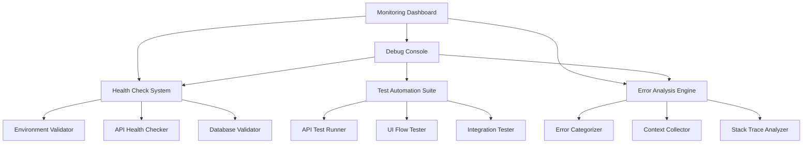

# Design Document

## Overview

The troubleshooting and debugging system will provide comprehensive tools and processes to identify, diagnose, and resolve issues in the RunSight application. The design focuses on creating multiple layers of debugging capabilities, from automated health checks to detailed error analysis tools.

## Architecture

### Core Components

1. **Debug Console** - Interactive debugging interface
2. **Health Check System** - Automated validation of all system components
3. **Error Analysis Engine** - Categorizes and analyzes errors with context
4. **Test Automation Suite** - Automated testing of critical flows
5. **Environment Validator** - Validates configurations and dependencies
6. **Monitoring Dashboard** - Real-time system health and metrics

### Component Interactions



## Components and Interfaces

### 1. Debug Console

**Purpose:** Central interface for all debugging operations

**Key Features:**
- Interactive command-line interface for debugging
- Real-time log streaming and filtering
- Manual test execution and result viewing
- Environment variable inspection and validation
- API endpoint testing with request/response inspection

**Interface:**
```typescript
interface DebugConsole {
  runHealthCheck(): Promise<HealthCheckResult>;
  testEndpoint(endpoint: string, options?: TestOptions): Promise<ApiTestResult>;
  validateEnvironment(): Promise<EnvironmentValidation>;
  analyzeError(error: Error, context?: any): ErrorAnalysis;
  streamLogs(filter?: LogFilter): AsyncIterable<LogEntry>;
}
```

### 2. Health Check System

**Purpose:** Automated validation of all system components

**Key Features:**
- Database connectivity and permissions testing
- External API availability and authentication verification
- Netlify function deployment and accessibility checks
- Environment variable presence and format validation
- Real-time dependency monitoring

**Interface:**
```typescript
interface HealthCheckSystem {
  checkDatabase(): Promise<DatabaseHealth>;
  checkExternalAPIs(): Promise<ExternalAPIHealth>;
  checkNetlifyFunctions(): Promise<FunctionHealth>;
  checkEnvironmentVariables(): Promise<EnvironmentHealth>;
  runFullHealthCheck(): Promise<SystemHealth>;
}
```

### 3. Error Analysis Engine

**Purpose:** Intelligent error categorization and analysis

**Key Features:**
- Automatic error categorization (network, auth, data, etc.)
- Context collection from error occurrence
- Stack trace analysis and source mapping
- Error pattern recognition and common solution suggestions
- Error frequency tracking and alerting

**Interface:**
```typescript
interface ErrorAnalysisEngine {
  categorizeError(error: Error): ErrorCategory;
  collectContext(error: Error): ErrorContext;
  analyzeStackTrace(stackTrace: string): StackAnalysis;
  suggestSolutions(error: Error): Solution[];
  trackErrorFrequency(error: Error): ErrorFrequency;
}
```

### 4. Test Automation Suite

**Purpose:** Automated testing of critical application flows

**Key Features:**
- API endpoint testing with various scenarios
- User flow simulation and validation
- Integration testing between components
- Performance and load testing capabilities
- Regression testing for bug fixes

**Interface:**
```typescript
interface TestAutomationSuite {
  runAPITests(): Promise<APITestResults>;
  runUserFlowTests(): Promise<UserFlowResults>;
  runIntegrationTests(): Promise<IntegrationResults>;
  runPerformanceTests(): Promise<PerformanceResults>;
  runRegressionTests(): Promise<RegressionResults>;
}
```

### 5. Environment Validator

**Purpose:** Comprehensive environment and configuration validation

**Key Features:**
- Environment variable validation and type checking
- API key and credential verification
- Database schema and migration validation
- Deployment configuration verification
- Security configuration auditing

**Interface:**
```typescript
interface EnvironmentValidator {
  validateEnvironmentVariables(): Promise<EnvValidation>;
  validateCredentials(): Promise<CredentialValidation>;
  validateDatabaseSchema(): Promise<SchemaValidation>;
  validateDeploymentConfig(): Promise<DeploymentValidation>;
  auditSecurityConfig(): Promise<SecurityAudit>;
}
```

## Data Models

### Error Analysis Models

```typescript
interface ErrorAnalysis {
  id: string;
  timestamp: Date;
  category: ErrorCategory;
  severity: 'low' | 'medium' | 'high' | 'critical';
  message: string;
  stackTrace: string;
  context: ErrorContext;
  suggestedSolutions: Solution[];
  frequency: number;
}

interface ErrorContext {
  userId?: string;
  sessionId: string;
  userAgent: string;
  url: string;
  requestData?: any;
  environmentInfo: EnvironmentInfo;
  previousActions: UserAction[];
}
```

### Health Check Models

```typescript
interface SystemHealth {
  overall: 'healthy' | 'degraded' | 'unhealthy';
  components: ComponentHealth[];
  timestamp: Date;
  recommendations: string[];
}

interface ComponentHealth {
  name: string;
  status: 'healthy' | 'degraded' | 'unhealthy';
  responseTime?: number;
  errorRate?: number;
  details: HealthDetail[];
}
```

### Test Result Models

```typescript
interface TestResult {
  testId: string;
  name: string;
  status: 'passed' | 'failed' | 'skipped';
  duration: number;
  timestamp: Date;
  details: TestDetail[];
  artifacts: TestArtifact[];
}

interface TestDetail {
  step: string;
  status: 'passed' | 'failed';
  message?: string;
  screenshot?: string;
  networkLogs?: NetworkLog[];
}
```

## Error Handling

### Error Categories

1. **Network Errors**
   - API connectivity issues
   - Timeout errors
   - Rate limiting responses
   - DNS resolution failures

2. **Authentication Errors**
   - Invalid tokens
   - Expired credentials
   - Permission denied
   - OAuth flow failures

3. **Data Errors**
   - Validation failures
   - Database constraint violations
   - Data transformation errors
   - Missing required fields

4. **System Errors**
   - Memory issues
   - Function timeouts
   - Configuration errors
   - Deployment failures

### Error Recovery Strategies

- **Automatic Retry:** For transient network and rate limiting errors
- **Token Refresh:** For expired authentication tokens
- **Graceful Degradation:** For non-critical feature failures
- **User Notification:** For errors requiring user action
- **Developer Alert:** For system-level errors requiring immediate attention

## Testing Strategy

### Unit Testing
- Individual component testing with mocked dependencies
- Error condition simulation and validation
- Edge case testing for all validation functions

### Integration Testing
- End-to-end API flow testing
- Database integration testing
- External service integration validation

### Performance Testing
- Load testing for API endpoints
- Memory usage monitoring
- Response time validation

### User Acceptance Testing
- Critical user flow validation
- Error message clarity testing
- Recovery process validation

## Implementation Phases

### Phase 1: Core Infrastructure
- Debug console foundation
- Basic health check system
- Error categorization engine

### Phase 2: Automated Testing
- API test automation
- User flow testing
- Integration test suite

### Phase 3: Advanced Analysis
- Error pattern recognition
- Performance monitoring
- Predictive issue detection

### Phase 4: Monitoring and Alerting
- Real-time monitoring dashboard
- Automated alerting system
- Historical trend analysis