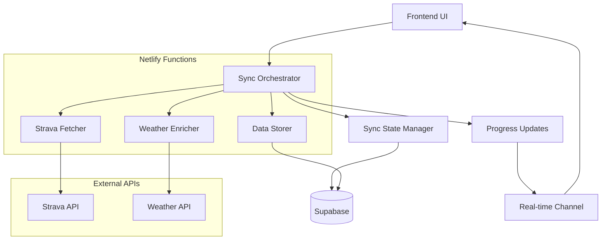
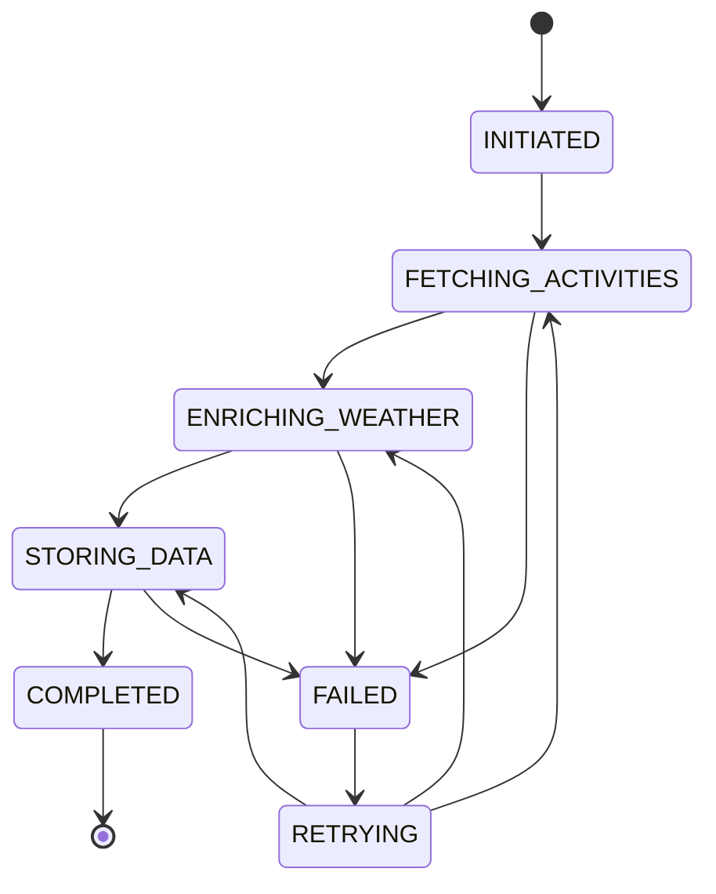

# Design Document

## Overview

The robust data sync system will be redesigned as a state-driven, queue-based architecture that leverages Netlify Functions and Supabase optimally. Instead of the current fragmented approach with multiple disconnected functions, we'll implement a unified sync orchestrator that manages the entire fetch-enrich-store pipeline through well-defined states and checkpoints.

The new architecture addresses the core issues in the current system:
- **Fragmented responsibilities** → Unified sync orchestrator
- **Poor error handling** → Comprehensive error recovery with state persistence
- **No progress tracking** → Real-time progress updates via Supabase
- **Resource inefficiency** → Platform-optimized batching and streaming
- **Unreliable token management** → Centralized auth handling with automatic refresh

## Architecture

### High-Level Architecture



### State-Driven Sync Process

The sync process will be managed through explicit states stored in Supabase:



## Components and Interfaces

### 1. Sync Orchestrator (`sync-orchestrator.js`)

**Purpose:** Central coordinator that manages the entire sync lifecycle.

**Key Responsibilities:**
- Initialize sync sessions with unique IDs
- Coordinate between fetching, enriching, and storing phases
- Handle state transitions and error recovery
- Provide real-time progress updates
- Manage resource allocation and throttling

**Interface:**
```typescript
interface SyncRequest {
  userId: string;
  timeRange: {
    after?: number;  // Unix timestamp
    before?: number; // Unix timestamp
  };
  options?: {
    batchSize?: number;
    maxRetries?: number;
    skipWeatherEnrichment?: boolean;
  };
}

interface SyncResponse {
  syncId: string;
  status: SyncStatus;
  progress: SyncProgress;
  results?: SyncResults;
  error?: SyncError;
}
```

### 2. Sync State Manager (`sync-state-manager.js`)

**Purpose:** Manages sync session state persistence and recovery.

**Clean Slate Database Schema:**
```sql
-- Drop all existing sync-related tables and start fresh
DROP TABLE IF EXISTS public.runs CASCADE;
DROP TABLE IF EXISTS public.sync_sessions CASCADE;

-- Create optimized runs table with better structure
CREATE TABLE public.runs (
  id uuid PRIMARY KEY DEFAULT gen_random_uuid(),
  user_id uuid NOT NULL REFERENCES auth.users(id) ON DELETE CASCADE,
  strava_id bigint NOT NULL,
  
  -- Core activity data
  name text NOT NULL,
  activity_type text NOT NULL DEFAULT 'Run',
  distance_meters real NOT NULL,
  moving_time_seconds integer NOT NULL,
  elapsed_time_seconds integer NOT NULL,
  
  -- Timing data
  start_date_utc timestamptz NOT NULL,
  start_date_local timestamptz NOT NULL,
  timezone text,
  
  -- Location data (optimized for queries)
  start_latitude real,
  start_longitude real,
  end_latitude real,
  end_longitude real,
  city text,
  state text,
  country text,
  
  -- Performance metrics
  average_speed_ms real,
  max_speed_ms real,
  average_heartrate_bpm integer,
  max_heartrate_bpm integer,
  total_elevation_gain_meters real,
  
  -- Weather data (structured for analytics)
  temperature_celsius real,
  feels_like_celsius real,
  humidity_percent integer,
  pressure_hpa real,
  wind_speed_ms real,
  wind_direction_degrees integer,
  weather_condition text,
  visibility_meters integer,
  uv_index real,
  
  -- Metadata
  enrichment_status jsonb NOT NULL DEFAULT '{"weather": false, "geocoding": false}',
  strava_data jsonb, -- Full Strava payload for future use
  sync_session_id uuid,
  
  -- Timestamps
  created_at timestamptz DEFAULT now(),
  updated_at timestamptz DEFAULT now(),
  
  -- Constraints
  UNIQUE(user_id, strava_id)
);

-- Sync sessions for robust state management
CREATE TABLE public.sync_sessions (
  id uuid PRIMARY KEY DEFAULT gen_random_uuid(),
  user_id uuid NOT NULL REFERENCES auth.users(id) ON DELETE CASCADE,
  
  -- Sync configuration
  sync_type text NOT NULL DEFAULT 'full',
  time_range_start timestamptz,
  time_range_end timestamptz,
  
  -- State management
  status text NOT NULL DEFAULT 'initiated',
  current_phase text NOT NULL DEFAULT 'fetching',
  
  -- Progress tracking
  total_activities_estimated integer DEFAULT 0,
  activities_fetched integer DEFAULT 0,
  activities_enriched integer DEFAULT 0,
  activities_stored integer DEFAULT 0,
  activities_failed integer DEFAULT 0,
  
  -- Error handling
  error_count integer DEFAULT 0,
  last_error jsonb,
  retry_count integer DEFAULT 0,
  
  -- Performance metrics
  started_at timestamptz DEFAULT now(),
  completed_at timestamptz,
  last_activity_at timestamptz DEFAULT now(),
  
  -- Checkpointing for resume capability
  last_successful_page integer DEFAULT 0,
  checkpoint_data jsonb,
  
  created_at timestamptz DEFAULT now(),
  updated_at timestamptz DEFAULT now()
);
```

**Interface:**
```typescript
interface SyncSession {
  id: string;
  userId: string;
  status: SyncStatus;
  timeRange: TimeRange;
  progress: SyncProgress;
  currentBatch?: BatchInfo;
  errorInfo?: ErrorInfo;
  createdAt: string;
  updatedAt: string;
}
```

### 3. Strava Fetcher (`strava-fetcher.js`)

**Purpose:** Handles all Strava API interactions with robust error handling.

**Key Features:**
- Automatic token refresh with persistence
- Rate limit handling with exponential backoff
- Pagination management with checkpoint saving
- Activity filtering and validation
- Duplicate detection

**Interface:**
```typescript
interface FetchRequest {
  userId: string;
  syncId: string;
  pagination: {
    page: number;
    perPage: number;
    after?: number;
    before?: number;
  };
}

interface FetchResponse {
  activities: StravaActivity[];
  pagination: {
    currentPage: number;
    hasMore: boolean;
    nextPage?: number;
  };
  metadata: {
    totalFetched: number;
    filteredCount: number;
    duplicatesSkipped: number;
  };
}
```

### 4. Weather Enricher (`weather-enricher.js`)

**Purpose:** Enriches activities with weather and location data.

**Key Features:**
- Batch processing for API efficiency
- Graceful degradation when weather data unavailable
- Geocoding integration
- Rate limit management
- Partial failure handling

**Interface:**
```typescript
interface EnrichmentRequest {
  activities: StravaActivity[];
  syncId: string;
  options: {
    includeGeocoding: boolean;
    batchSize: number;
  };
}

interface EnrichmentResponse {
  enrichedActivities: EnrichedActivity[];
  metadata: {
    weatherEnriched: number;
    geocoded: number;
    failed: number;
    skipped: number;
  };
}
```

### 5. Data Storer (`data-storer.js`)

**Purpose:** Handles database operations with transaction safety.

**Key Features:**
- Atomic batch operations
- Upsert logic for handling duplicates
- Data validation and sanitization
- Rollback on partial failures
- Performance optimization

**Interface:**
```typescript
interface StoreRequest {
  activities: EnrichedActivity[];
  userId: string;
  syncId: string;
}

interface StoreResponse {
  results: {
    saved: number;
    updated: number;
    skipped: number;
    failed: number;
  };
  failedActivities?: FailedActivity[];
}
```

## Data Models

### Core Data Structures

```typescript
interface SyncProgress {
  totalActivities: number;
  processedActivities: number;
  currentPhase: SyncPhase;
  phaseProgress: {
    fetching: PhaseProgress;
    enriching: PhaseProgress;
    storing: PhaseProgress;
  };
  startTime: string;
  estimatedCompletion?: string;
}

interface PhaseProgress {
  status: 'pending' | 'in_progress' | 'completed' | 'failed';
  processed: number;
  total: number;
  errors: number;
  startTime?: string;
  endTime?: string;
}

interface BatchInfo {
  batchId: string;
  activities: string[]; // Activity IDs
  phase: SyncPhase;
  retryCount: number;
  lastError?: string;
}

interface ErrorInfo {
  code: string;
  message: string;
  phase: SyncPhase;
  retryable: boolean;
  context: Record<string, any>;
  timestamp: string;
}
```

### Enhanced Activity Model

```typescript
interface EnrichedActivity {
  // Core Strava data
  stravaId: number;
  name: string;
  type: string;
  distance: number;
  movingTime: number;
  elapsedTime: number;
  startDate: string;
  startDateLocal: string;
  
  // Location data
  startLatLng?: [number, number];
  endLatLng?: [number, number];
  city?: string;
  state?: string;
  country?: string;
  
  // Performance data
  averageSpeed: number;
  maxSpeed?: number;
  averageHeartrate?: number;
  maxHeartrate?: number;
  totalElevationGain?: number;
  
  // Weather data
  weatherData?: {
    temperature: number;
    feelsLike: number;
    humidity: number;
    pressure: number;
    windSpeed: number;
    windDirection: number;
    conditions: string;
    visibility?: number;
    uvIndex?: number;
  };
  
  // Metadata
  enrichmentStatus: {
    weatherEnriched: boolean;
    geocoded: boolean;
    errors?: string[];
  };
  
  // Full Strava payload for future use
  stravaData: Record<string, any>;
}
```

## Error Handling

### Error Classification

```typescript
enum ErrorType {
  // Retryable errors
  NETWORK_ERROR = 'network_error',
  RATE_LIMIT = 'rate_limit',
  TEMPORARY_API_ERROR = 'temporary_api_error',
  DATABASE_TIMEOUT = 'database_timeout',
  
  // Non-retryable errors
  AUTHENTICATION_ERROR = 'authentication_error',
  INVALID_DATA = 'invalid_data',
  PERMISSION_DENIED = 'permission_denied',
  QUOTA_EXCEEDED = 'quota_exceeded',
  
  // System errors
  FUNCTION_TIMEOUT = 'function_timeout',
  MEMORY_LIMIT = 'memory_limit',
  UNKNOWN_ERROR = 'unknown_error'
}
```

### Recovery Strategies

1. **Exponential Backoff:** For rate limits and temporary failures
2. **Circuit Breaker:** For persistent API failures
3. **Checkpoint Recovery:** Resume from last successful state
4. **Partial Success Handling:** Continue processing despite individual failures
5. **Graceful Degradation:** Skip non-critical enrichments when APIs fail

### Error Reporting

```typescript
interface ErrorReport {
  syncId: string;
  userId: string;
  errorType: ErrorType;
  phase: SyncPhase;
  message: string;
  context: {
    activityId?: string;
    batchId?: string;
    apiEndpoint?: string;
    httpStatus?: number;
    retryCount: number;
  };
  timestamp: string;
  resolved: boolean;
}
```

## Testing Strategy

### Unit Testing
- **Sync Orchestrator:** State transitions, error handling, progress calculation
- **Strava Fetcher:** Token refresh, pagination, rate limiting, activity filtering
- **Weather Enricher:** API integration, batch processing, error handling
- **Data Storer:** Transaction handling, upsert logic, validation
- **State Manager:** State persistence, recovery logic, concurrent access

### Integration Testing
- **End-to-End Sync:** Complete sync flow with mock APIs
- **Error Recovery:** Simulated failures at each phase
- **Concurrent Operations:** Multiple users syncing simultaneously
- **Platform Limits:** Netlify function timeouts, Supabase connection limits

### Performance Testing
- **Large Dataset Handling:** Sync 1000+ activities
- **Memory Usage:** Monitor function memory consumption
- **API Rate Limits:** Verify proper throttling
- **Database Performance:** Batch insert/update operations

### Monitoring and Observability

#### Metrics to Track
- Sync success/failure rates
- Average sync duration by data volume
- API response times and error rates
- Database operation performance
- Function execution times and memory usage

#### Logging Strategy
- Structured logging with correlation IDs
- Performance metrics at each phase
- Detailed error context for debugging
- User action tracking for analytics

#### Alerting
- High error rates (>5% failures)
- Sync duration anomalies (>2x normal time)
- API quota approaching limits (>80% usage)
- Database connection pool exhaustion

## Platform Optimizations

### Netlify Functions
- **Function Splitting:** Separate functions for each major component to stay within execution limits
- **Background Processing:** Use Netlify's background functions for long-running operations
- **Cold Start Optimization:** Minimize initialization overhead
- **Memory Management:** Efficient memory usage to avoid limits

### Supabase Integration
- **Real-time Updates:** Use Supabase real-time for progress updates
- **Row Level Security:** Ensure user data isolation
- **Connection Pooling:** Efficient database connection management
- **Batch Operations:** Optimize database writes with batch inserts/updates

### Performance Considerations
- **Streaming Processing:** Process data in streams to minimize memory usage
- **Intelligent Batching:** Optimize batch sizes based on data characteristics
- **Caching Strategy:** Cache frequently accessed data (user tokens, API responses)
- **Resource Throttling:** Prevent resource exhaustion during high-load periods