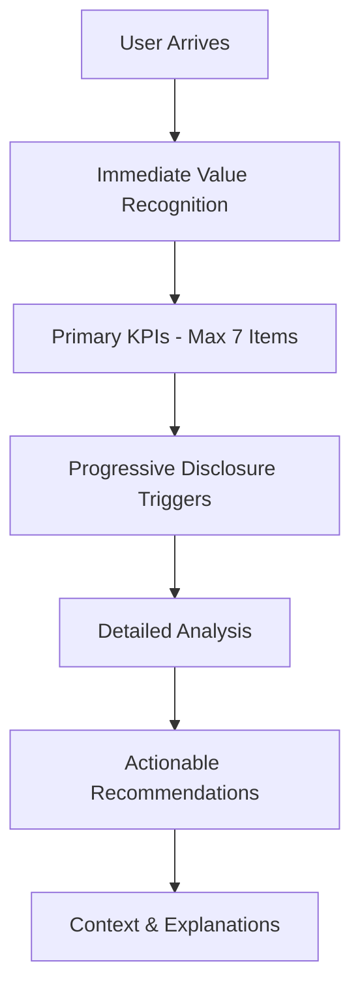

# Design Document

## Overview

This design document outlines the comprehensive improvements to make RunSight Web launch-ready as an open-source project. The design is based on cognitive psychology research, established UX principles, and focuses on optimizing the actual production deployment experience (Netlify + Supabase + OpenWeatherMap + Strava).

The core philosophy is to create a runner's companion that minimizes cognitive load while maximizing actionable insights, following the principle that users should spend their mental energy understanding their performance, not learning how to use the interface.

## Architecture

### Cognitive Load Management Architecture

The application will implement a three-tier information architecture based on cognitive psychology research:

1. **Primary Layer (7±2 Rule)**: Essential information immediately visible
2. **Secondary Layer (Progressive Disclosure)**: Detailed data available on demand
3. **Context Layer (External Memory)**: System-provided explanations and smart defaults

### Information Flow Design



### Production-First Testing Architecture

All improvements will be validated using the actual production stack:
- **Netlify**: Deployment, Functions, Environment Variables
- **Supabase**: Database, RLS, Authentication
- **Strava API**: OAuth, Activity Data
- **OpenWeatherMap**: Weather Enrichment

## Components and Interfaces

### 1. Cognitive Load Optimized Dashboard

#### Primary Information Layer (Always Visible)
- **KPI Cards (Max 4)**: Most critical metrics with trend indicators
- **Primary Chart**: Main performance trend (pace over time)
- **Quick Status**: Sync status, data freshness, recent activity count

#### Secondary Information Layer (Progressive Disclosure)
- **Detailed Charts**: Accessible via "View Details" buttons
- **Advanced Metrics**: Behind "Advanced" toggles
- **Historical Comparisons**: Available through time period selectors

#### Design Specifications
```typescript
interface CognitiveDashboard {
  primaryKPIs: KPICard[]; // Max 4 cards
  primaryChart: ChartComponent;
  quickStatus: StatusIndicator;
  secondaryContent: ProgressiveDisclosureSection[];
}

interface KPICard {
  title: string; // Clear, familiar terminology
  value: string; // Large, prominent display
  trend: TrendIndicator; // Visual trend arrow/color
  context: string; // Brief explanation
  detailsLink?: string; // Progressive disclosure
}
```

### 2. Information Scent Optimized Navigation

#### Navigation Design Principles
- **Descriptive Labels**: Clear indication of content value
- **Consistent Positioning**: Build muscle memory
- **Visual Hierarchy**: Most important sections prominent

#### Navigation Structure
```typescript
interface NavigationItem {
  label: string; // High information scent
  description: string; // Tooltip explaining value
  icon: IconComponent; // Visual recognition aid
  badge?: NotificationBadge; // New insights indicator
}
```

### 3. Recognition-Based Insights System

#### Insight Card Design
Each insight follows a consistent pattern to build user recognition:

```typescript
interface InsightCard {
  title: string; // Clear, action-oriented
  summary: string; // One-sentence key finding
  visualization: ChartComponent; // Familiar chart type
  interpretation: string; // What this means for the user
  recommendation?: string; // What to do about it
  confidence: ConfidenceLevel; // Data reliability indicator
}
```

#### Insight Prioritization Algorithm
1. **Impact Score**: Potential performance improvement
2. **Confidence Score**: Data reliability and sample size
3. **Actionability Score**: How easily user can act on insight
4. **Recency Score**: Relevance to recent training

### 4. Task Offloading System

#### Smart Defaults Implementation
- **Time Periods**: Automatically select most relevant period
- **Comparisons**: Auto-highlight significant changes
- **Filters**: Remember user preferences
- **Explanations**: Provide context without requiring recall

#### External Memory Features
```typescript
interface ExternalMemory {
  userPreferences: UserPreferences;
  contextualHelp: ContextualHelpSystem;
  smartDefaults: SmartDefaultsEngine;
  progressTracking: ProgressTrackingSystem;
}
```

### 5. Fitts's Law Compliant Interface

#### Interactive Element Specifications
- **Mobile Touch Targets**: Minimum 44px × 44px
- **Desktop Click Targets**: Minimum 32px × 32px
- **Spacing**: Minimum 8px between interactive elements
- **Positioning**: Frequently used controls near related content

#### Responsive Design Matrix
```typescript
interface ResponsiveSpecs {
  mobile: {
    touchTargetSize: '44px';
    spacing: '16px';
    fontSize: '16px'; // Prevent zoom on iOS
  };
  tablet: {
    touchTargetSize: '40px';
    spacing: '12px';
    fontSize: '15px';
  };
  desktop: {
    clickTargetSize: '32px';
    spacing: '8px';
    fontSize: '14px';
  };
}
```

## Data Models

### Cognitive Load Optimized Data Structure

#### Dashboard Data Model
```typescript
interface CognitiveDashboardData {
  primaryMetrics: PrimaryMetric[]; // Max 4 items
  trendData: TrendDataPoint[];
  insights: PrioritizedInsight[];
  contextualInfo: ContextualInformation;
}

interface PrimaryMetric {
  id: string;
  name: string; // Familiar running terminology
  value: number;
  unit: string;
  trend: 'up' | 'down' | 'stable';
  trendPercentage: number;
  context: string; // Brief explanation
  significance: 'high' | 'medium' | 'low';
}
```

#### Insight Data Model
```typescript
interface PrioritizedInsight {
  id: string;
  title: string;
  category: InsightCategory;
  priority: number; // 1-10 based on impact/confidence/actionability
  summary: string; // One sentence key finding
  data: InsightData;
  interpretation: string; // What it means
  recommendation?: string; // What to do
  confidence: number; // 0-1 confidence score
  sampleSize: number;
  timeframe: string;
}
```

### Production Deployment Data Model

#### Deployment Configuration
```typescript
interface ProductionConfig {
  netlify: {
    buildCommand: string;
    publishDir: string;
    functions: string;
    environmentVariables: EnvironmentVariable[];
  };
  supabase: {
    projectUrl: string;
    anonKey: string; // Public key only
    migrations: Migration[];
  };
  apis: {
    strava: StravaConfig;
    openWeatherMap: OWMConfig;
  };
}
```

## Error Handling

### Cognitive Load Aware Error Handling

#### Error Message Design Principles
1. **Plain Language**: No technical jargon
2. **Actionable**: Clear next steps
3. **Context Aware**: Relevant to user's current task
4. **Progressive**: Basic message with details available

#### Error Handling Architecture
```typescript
interface CognitiveErrorHandler {
  categorizeError(error: Error): ErrorCategory;
  generateUserMessage(category: ErrorCategory): UserFriendlyMessage;
  provideRecoveryOptions(category: ErrorCategory): RecoveryOption[];
  logForDevelopers(error: Error, context: UserContext): void;
}

interface UserFriendlyMessage {
  title: string; // Brief, clear problem statement
  description: string; // Plain language explanation
  actions: ActionButton[]; // What user can do
  technicalDetails?: string; // Available via "Show Details"
}
```

### Production Environment Error Handling

#### Deployment-Specific Error Scenarios
1. **Netlify Function Errors**: API key configuration issues
2. **Supabase Connection**: RLS policy problems
3. **Strava API**: Rate limiting, token expiration
4. **OpenWeatherMap**: Quota exceeded, invalid coordinates

#### Error Recovery System
```typescript
interface ProductionErrorRecovery {
  netlifyFunctionErrors: NetlifyErrorHandler;
  supabaseErrors: SupabaseErrorHandler;
  apiErrors: APIErrorHandler;
  deploymentErrors: DeploymentErrorHandler;
}
```

## Testing Strategy

### Cognitive Load Testing

#### Usability Testing Protocol
1. **5-Second Test**: Can users understand primary value in 5 seconds?
2. **First-Click Test**: Do users click the right thing first?
3. **Task Completion**: Can users complete key tasks without help?
4. **Cognitive Load Assessment**: Measure mental effort required

#### Testing Metrics
```typescript
interface CognitiveLoadMetrics {
  timeToValue: number; // Seconds to understand key insight
  taskCompletionRate: number; // Percentage completing tasks
  errorRate: number; // User mistakes per session
  cognitiveLoadScore: number; // Subjective mental effort (1-10)
  satisfactionScore: number; // User satisfaction (1-10)
}
```

### Production Stack Testing

#### End-to-End Deployment Testing
1. **Fresh Account Testing**: Test with new accounts on all services
2. **API Integration Testing**: Validate against actual API responses
3. **Security Testing**: Penetration testing on deployed application
4. **Performance Testing**: Load testing with real data volumes

#### Testing Environment Matrix
```typescript
interface ProductionTestMatrix {
  netlifyDeployment: {
    buildProcess: TestCase[];
    functionExecution: TestCase[];
    environmentVariables: TestCase[];
  };
  supabaseIntegration: {
    authentication: TestCase[];
    dataAccess: TestCase[];
    rlsPolicies: TestCase[];
  };
  apiIntegrations: {
    stravaOAuth: TestCase[];
    weatherEnrichment: TestCase[];
    rateLimiting: TestCase[];
  };
}
```

### Automated Testing Strategy

#### Cognitive UX Testing Automation
```typescript
interface AutomatedUXTests {
  informationArchitecture: {
    maxItemsPerView: () => boolean; // Verify 7±2 rule
    visualHierarchy: () => boolean; // Check heading structure
    progressiveDisclosure: () => boolean; // Verify layered content
  };
  interactionDesign: {
    touchTargetSizes: () => boolean; // Fitts's law compliance
    clickTargetSizes: () => boolean;
    spacing: () => boolean;
  };
  contentStrategy: {
    informationScent: () => boolean; // Check label clarity
    contextualHelp: () => boolean; // Verify explanations
    actionableInsights: () => boolean; // Check recommendations
  };
}
```

## Implementation Phases

### Phase 1: Cognitive Load Optimization (Week 1-2)
1. **Dashboard Restructuring**: Implement 7±2 rule
2. **Progressive Disclosure**: Add detail layers
3. **Visual Hierarchy**: Improve information scent
4. **Smart Defaults**: Implement external memory features

### Phase 2: Production Stack Validation (Week 2-3)
1. **Deployment Testing**: End-to-end with fresh accounts
2. **Security Audit**: Production environment testing
3. **Performance Optimization**: Real-world load testing
4. **Error Handling**: Production-specific error scenarios

### Phase 3: User Experience Polish (Week 3-4)
1. **Fitts's Law Compliance**: Optimize interactive elements
2. **Recognition Patterns**: Standardize familiar interfaces
3. **Actionable Insights**: Enhance recommendation system
4. **Documentation**: Progressive disclosure in setup guides

### Phase 4: Launch Preparation (Week 4)
1. **Final Testing**: Complete production stack validation
2. **Documentation Polish**: User-friendly setup guides
3. **Community Readiness**: Contribution guidelines
4. **Performance Monitoring**: Analytics and error tracking

## Success Metrics

### Cognitive Load Success Metrics
- **Time to First Insight**: < 30 seconds from login
- **Task Completion Rate**: > 90% for primary tasks
- **Cognitive Load Score**: < 5/10 (subjective mental effort)
- **User Satisfaction**: > 8/10

### Production Deployment Success Metrics
- **Setup Success Rate**: > 95% complete deployment without help
- **Time to Working App**: < 30 minutes from start to finish
- **Error Rate**: < 5% encounter blocking errors
- **Support Requests**: < 10% need additional help

### Technical Performance Metrics
- **Page Load Time**: < 3 seconds initial load
- **Time to Interactive**: < 5 seconds
- **Core Web Vitals**: All metrics in "Good" range
- **Accessibility Score**: > 95% WCAG AA compliance